# ZapEats - Food Delivery App Flowchart

## 🏗️ **System Architecture Overview**

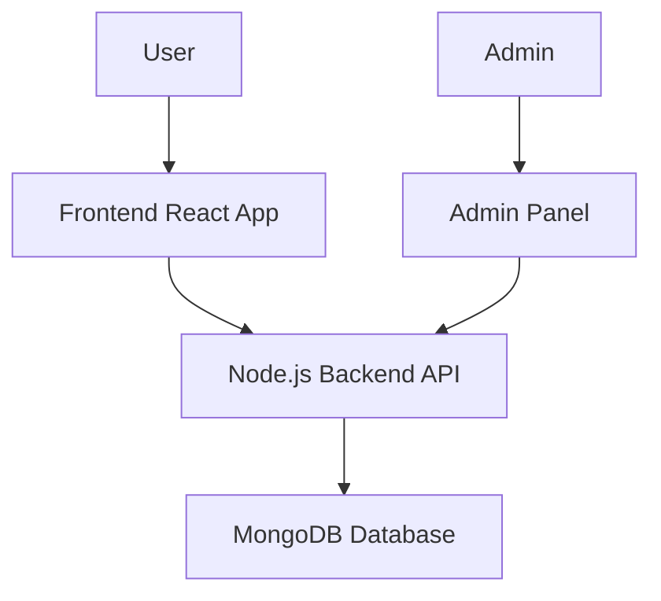

## 🔐 **Authentication Flow**

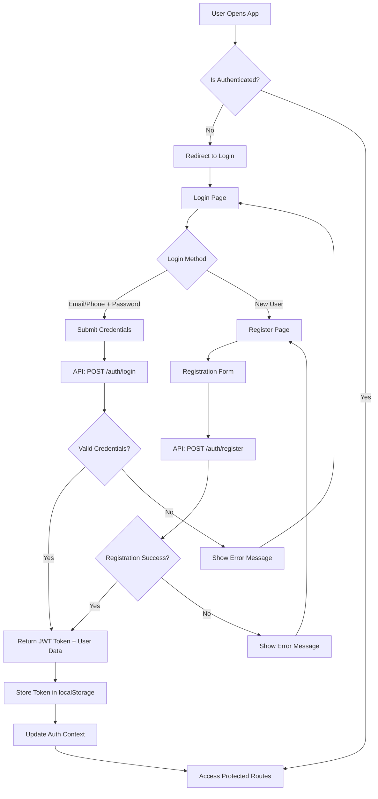

## 🍽️ **Main Application Flow**

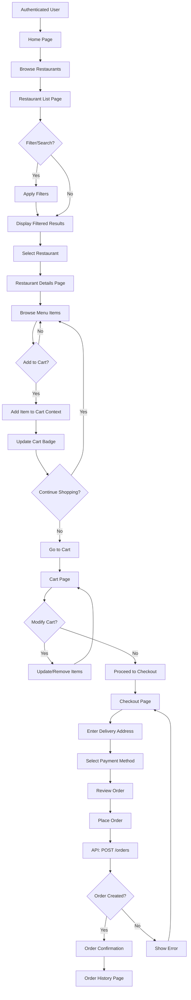

## 📦 **Order Management Flow**

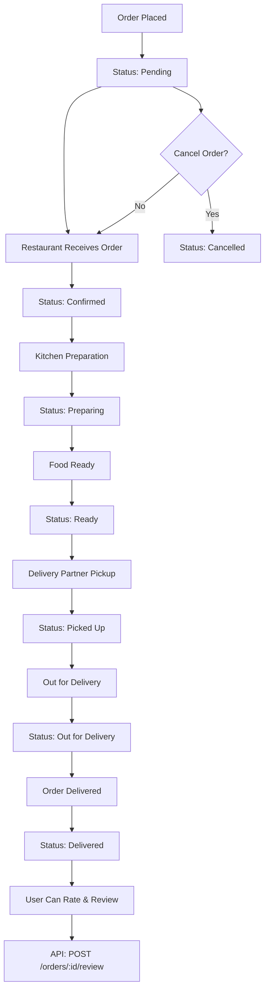

## 👤 **User Profile Management**

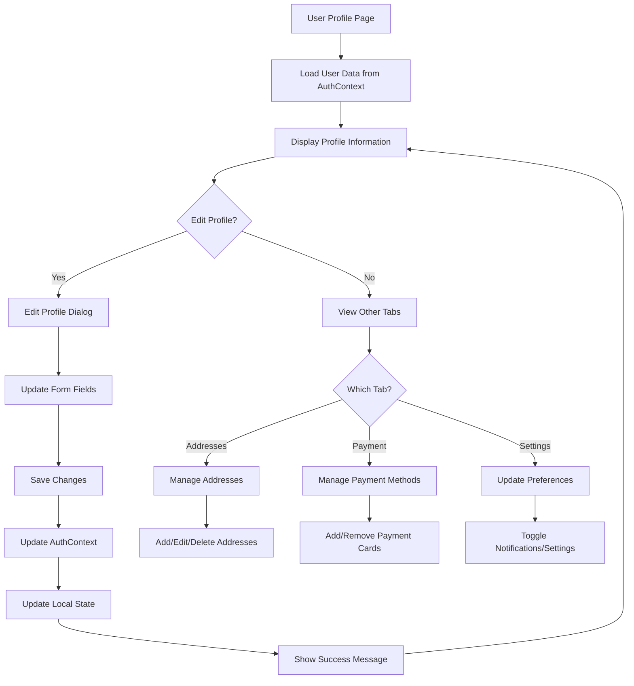

## 🏪 **Restaurant & Menu Management**

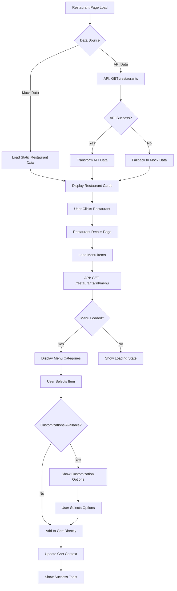

## 🛒 **Cart Management Flow**

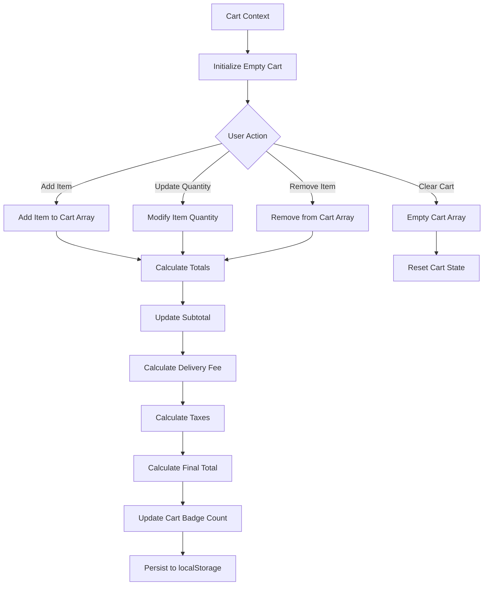

## 🔄 **State Management Flow**

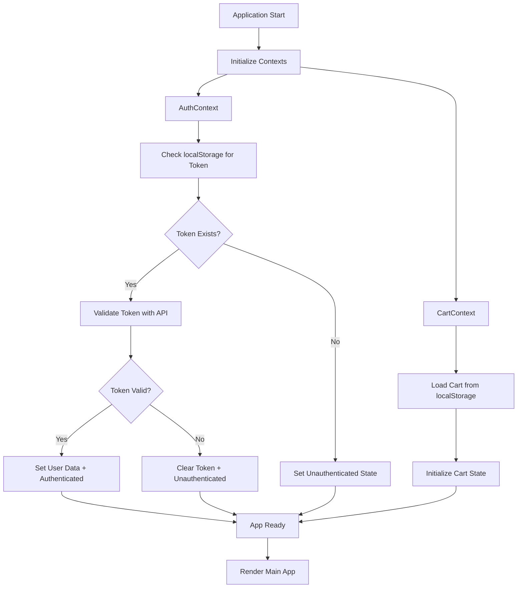

## 🚀 **Deployment & Build Flow**

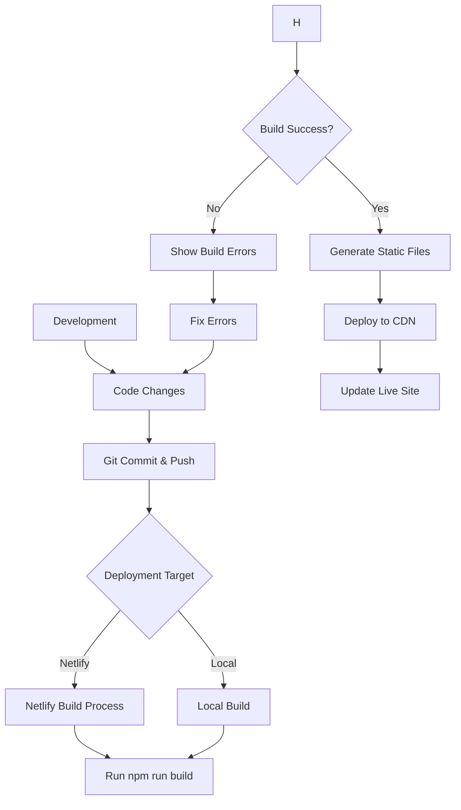

## 📊 **Data Flow Architecture**

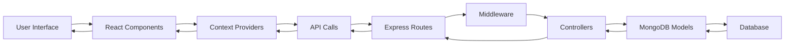

## 🔧 **Error Handling Flow**

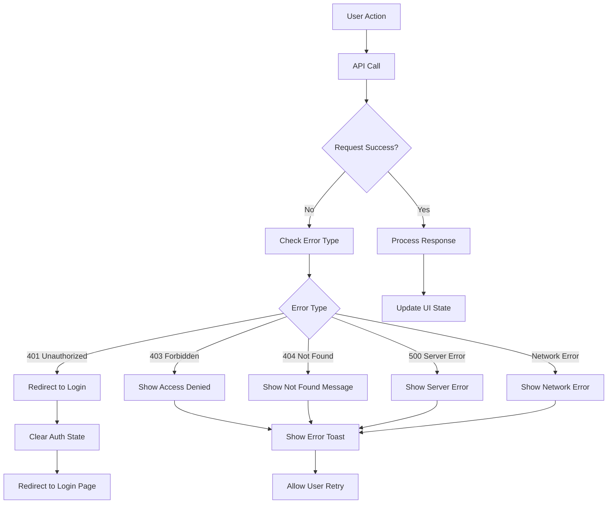

---

## 📋 **Technology Stack Summary**

### **Frontend (Port 3002)**
- **Framework**: React 18 with TypeScript
- **Routing**: React Router v6
- **UI Library**: Material-UI (MUI)
- **State Management**: Context API + useReducer
- **HTTP Client**: Axios
- **Animations**: Framer Motion
- **Notifications**: React Hot Toast

### **Backend (Port 5001)**
- **Runtime**: Node.js
- **Framework**: Express.js
- **Database**: MongoDB with Mongoose
- **Authentication**: JWT + bcrypt
- **Validation**: Express Validator
- **CORS**: Enabled for cross-origin requests

### **Database Collections**
- **users**: User profiles and authentication
- **restaurants**: Restaurant information
- **menuitems**: Menu items and categories
- **orders**: Order history and tracking
- **reviews**: User reviews and ratings

### **Key Features Implemented**
- ✅ User Authentication (Login/Register)
- ✅ Restaurant Browsing with Filters
- ✅ Menu Item Selection with Customization
- ✅ Cart Management with Persistence
- ✅ Order Placement and Tracking
- ✅ User Profile Management
- ✅ Order History with Reviews
- ✅ Real-time Status Updates
- ✅ Responsive Design
- ✅ Error Handling & Validation

This flowchart provides a comprehensive overview of your ZapEats application architecture and user flows! 🎉